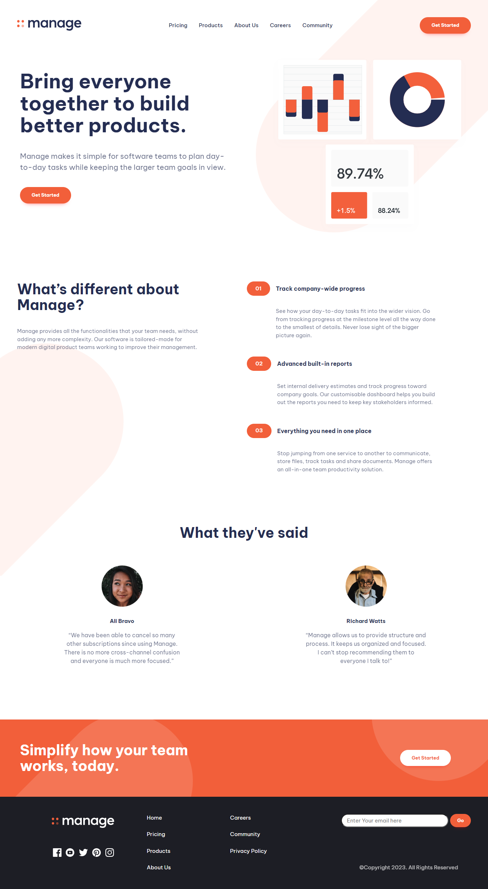
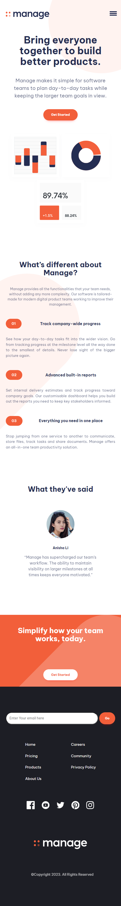

# Manage - A challange by Frontend Mentor

This is a Website I made using HTML and vanilla CSS to improve my Front-End skills. The layout of the website is a solution to the ["Manage landing page" challenge on Frontend Mentor](https://www.frontendmentor.io/challenges/manage-landing-page-SLXqC6P5). Frontend Mentor challenges help you improve your coding skills by building realistic projects. 

## Links

- Live Site URL: [https://itsabdullahmaqsood.github.io/Manage-FrontEnd/](https://itsabdullahmaqsood.github.io/Manage-FrontEnd/)
## Built with

- Semantic HTML5 markup
- CSS custom properties
- Flexbox
- CSS Grid
- Mobile-first workflow
- [a11ySlider](https://a11yslider.js.org/) - For the slider

<h2 align="center"> Desktop Layout of My Website </h2>

<h2> Mobile Layout of My Website </h2>

## Author

- My Profile on Frontend Mentor - [@itsAbdullahMaqsood](https://www.frontendmentor.io/profile/itsAbdullahMaqsood)

- My Linkedin - [@AbdullahMaqsood](https://www.linkedin.com/in/abdullahmaqsood321)

